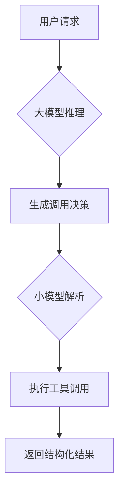

## 大模型api为什么需要具备工具调用能力？
大多数的agent框架或者mcp客户端需要模型api支持工具调用能力

## 直接工具调用和间接工具调用
- 直接工具调用
  
api返回的结果中有字段专门存储工具调用的结果
- 间接工具调用
  
在提示词中让模型按照给定格式返回工具调用的结果，然后从content中解析出工具参数和名称
```
ChatCompletion(id='0196bea6713a7620552a143e3aa91f93', choices=[Choice(finish_reason='tool_calls', index=0, logprobs=None, message=ChatCompletionMessage(content='', refusal=None, role='assistant', annotations=None, audio=None, function_call=None, tool_calls=[ChatCompletionMessageToolCall(id='0196bea67535a49350b2ab4b41a7e588', function=Function(arguments='{"location": "北京市"}', name='get_current_weather'), type='function')]))], created=1746955301, model='Qwen/Qwen2.5-7B-Instruct', object='chat.completion', service_tier=None, system_fingerprint='', usage=CompletionUsage(completion_tokens=22, prompt_tokens=273, total_tokens=295, completion_tokens_details=None, prompt_tokens_details=None))
```

## 实现流程
