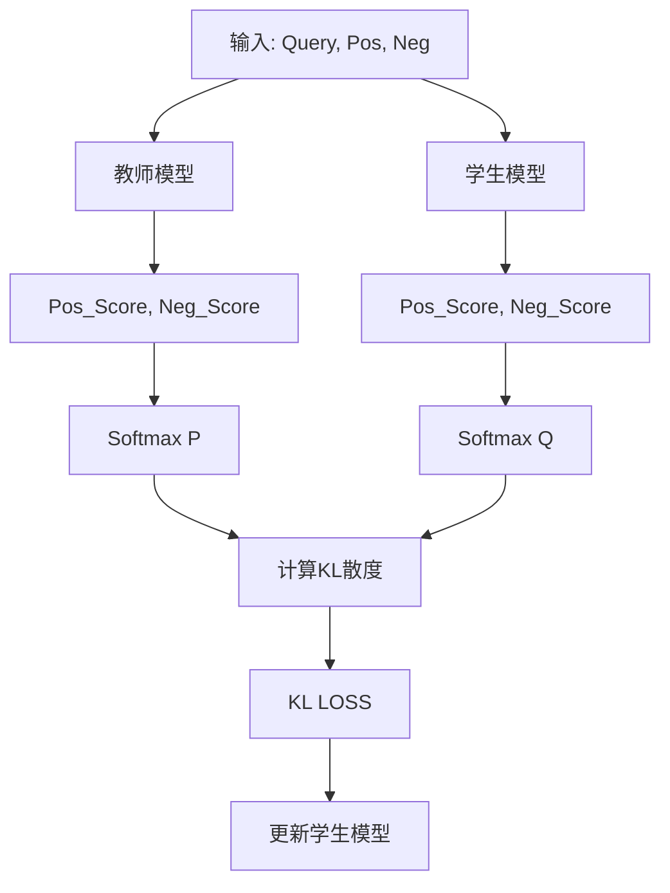

# EMBEDDING蒸馏
## 蒸馏原理

## 数据集说明
- origin_data: 原始数据集(包含训练集和验证集)
- processed_data: 处理后的训练数据(qyery, pos, neg)，正样本单条，负样本单条或多条（随机抽样）
- train_data: 教师模型生成的训练数据（包含正负样本及其分数）

## 代码说明
- data_process.py: 处理原始数据集，使用全部正样本，对负样本进行抽样，保存为processed_data文件夹
- get_distillation_data_local.py: 加载本地模型，由教师模型生成蒸馏数据，保存在train_data文件夹
- get_distillation_data_openai.py: 加载openai模型服务，由教师模型生成蒸馏数据，保存在train_data文件夹
- train.py: 训练代码
- merge.py: 合并lora权重
- evaluation.py: 验证集评估模型效果

## 注意事项
合并完lora权重之后，需要将原始模型权重文件中的如下文件拷贝至合并权重之后的文件夹
- 1_Pooling
- config_sentence_transformers.json
- configuration.json
- generator_config.json
- modules.json

原因是qwen3-embedding原始模型使用last token的向量作为句子向量，在训练中使用的也是last token，如果缺少上述文件，使用sentence_transformers评估加载模型时会默认使用所有token的平均向量作为句子向量，训练和测试不一致会导致测试性能低于原始模型

## 模型效果

| 模型名称                                | MAP       | MRR@10    | NDCG@10   |
|-------------------------------------|-----------|-----------|-----------|
| 教师模型 Qwen3-Embedding-4B          | 0.8887    | 0.9710    | 0.9226    |
| 教师模型 Qwen3-Embedding-8B          | 0.8940    | 0.9710    | 0.9272    |
| 学生模型 Qwen3-Embedding-0.6B        | 0.8536    | 0.9545    | 0.8955    |
| 蒸馏后（LoRA，负样本数10，T=1，教师模型4B）  | 0.8785    | 0.9630    | 0.9150    |
| 蒸馏后（全参，负样本数10，T=2，教师模型4B）  | 0.8757    | 0.9632    | 0.9139    |
| 蒸馏后（LoRA，负样本数1，T=1，教师模型4B）   | 0.8730    | 0.9599    | 0.9117    |
| 蒸馏后（LoRA，负样本数1，T=1，教师模型8B）   | 0.8719    | 0.9620    | 0.9116    |

## 模型数据连接
https://pan.quark.cn/s/4c82c4d253ac
