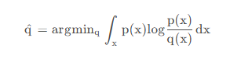
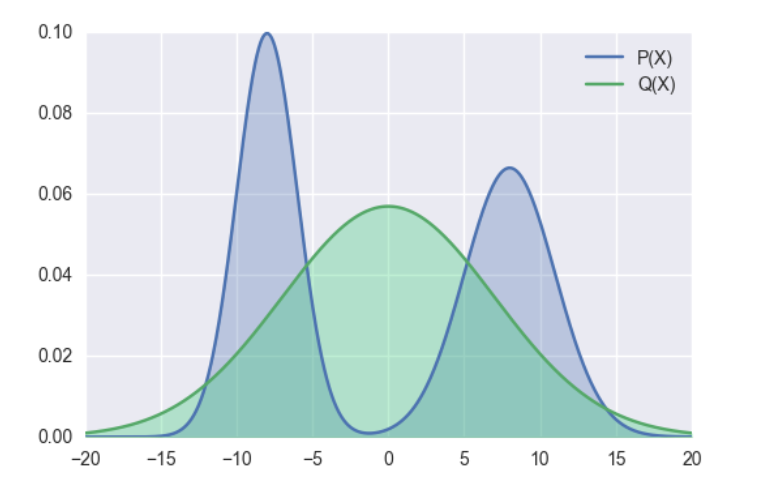
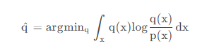
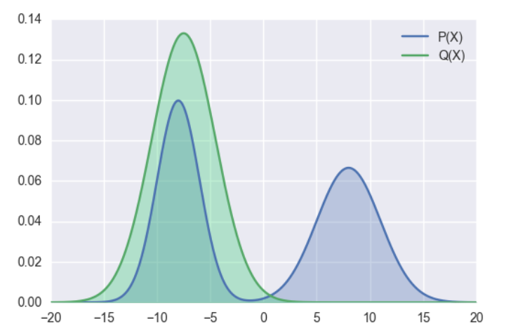

## 原理
将待压缩的模型作为教师模型，将体积更小的模型作为学生模型，让学生模型在教师模型的监督下进行优化，将学生模型学习到教师模型的概率分布，通过kl散度进行控制。
## 方法
对于大模型的知识蒸馏，主要分为两种：
### 其一、黑盒知识蒸馏。
使用大模型生成数据，通过这些数据去微调更小的模型，来达到蒸馏的目的。缺点是蒸馏效率低，优点是实现简单。
### 其二、白盒知识蒸馏。
获取学生模型和教师模型的输出概率分布（或者中间隐藏层的概率分布），通过kl散度将学生模型的概率分布向教师模型对齐。
下面主要介绍和测试白盒知识蒸馏：
白盒知识蒸馏主要在于模型分布的对齐，模型分布对齐主要依赖kl散度，对于kl散度的使用又有如下几种方式：
#### 其一、前向kl散度。
也就是我们经常说的kl散度。\
\
p为教师模型的概率分布，q为学生模型的概率分布，minillm论文中提到前向kl散度可能会使学生模型高估教师模型中概率比较低的位置，结合公式来看，当p增大时，为了使得kl散度小，则q也需要增大，但是当p趋于0时，无论q取任何值，kl散度都比较小，因为此时p(x)log((p(x)/q(x)))的大小主要受p(x)控制，这样起不到优化q分布的效果，可能会使q分布高估p分布中概率低的位置。
下图展示了前向kl散度的拟合情况，前向kl散度是一种均值搜索，更倾向于拟合多峰

#### 其二、反向kl散度。
为了缓解前向kl散度的缺点，提出了反向kl散度。\
\
p为教师模型的概率分布，q为学生模型的概率分布，当p趋于零时，为了使kl散度小，q也需趋于0。
minillm论文中说对于大模型的知识蒸馏，反向kl散度优于前向kl散度，但是也有其他论文说反向kl散度不一定比前向kl散度更优，实际选择中，可能要基于实验驱动。
反向kl散度是一种模式搜索，更倾向于拟合单个峰

#### 其三、偏向前kl散度。
对学生模型的分布和教师模型的分布进行加权作为学生模型的分布。
#### 其四、偏向反kl散度。
对学生模型的分布和教师模型的分布进行加权作为教师模型的分布。
## 三、测试
qwen2.5-3b作为教师模型，qwen2.5-0.5b作为学生模型\
流程如下：\
1、将qwen2.5-3b模型在指定数据集上微调（训练数据5000条，测试数据1000条，测试准确度为81.1%）\
2、探索如下三种方案下的蒸馏效果（均使用前向kl散度）：\
2.1 不微调学生模型+kl散度损失\
蒸馏1个epoch，准确度70.5%\
蒸馏2个epoch，准确度73%\
2.2 微调学生模型（模型准确度80.3%）+kl散度损失\
蒸馏2个epoch，准确度61.9%\
2.3 不微调学生模型+kl散度损失和交叉熵损失加权\
蒸馏2个epoch，70.5%\
3、上述实验中只使用kl散度的效果最好，如下实验中使用kl散度的变种进行测试，经过测试，效果都不如前向kl散度效果好。\
3.1 反向kl散度\
准确率只有54%\
3.2 偏向前向kl散度\
损失下降异常，效果很差，不断重复输出。\
由于资源和时间的限制，所有测试均保持相同的超参数，未针对不同损失设置不同超参数。