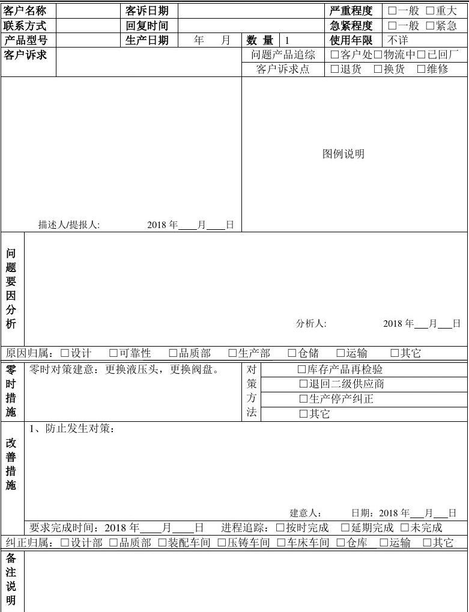
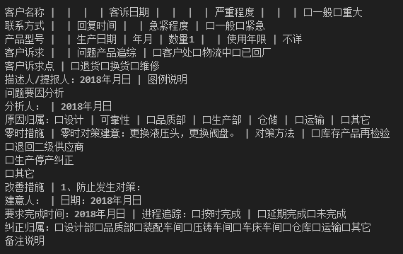

# table2txt

## 介绍
支持图片或者pdf中的普通文本提取和表格中文本的提取(pdf需要先转成图片)，并保持其结构化排版布局（尽量保持其结构，不完美）

可参考如下示例：

需要提取的图片：

提取之后：

## 使用方法

1、下载模型

modelscope下载表格提取模型，并修改代码中相关路径

https://modelscope.cn/models/iic/cv_dla34_table-structure-recognition_cycle-centernet

2、修改代码中需要提取的图片路径

## 注意

有时会出现调整完坐标之后的效果图片无法绘制的情况，可忽略，文字可正常提取

代码中有不完善的地方，可根据需要自行修改
